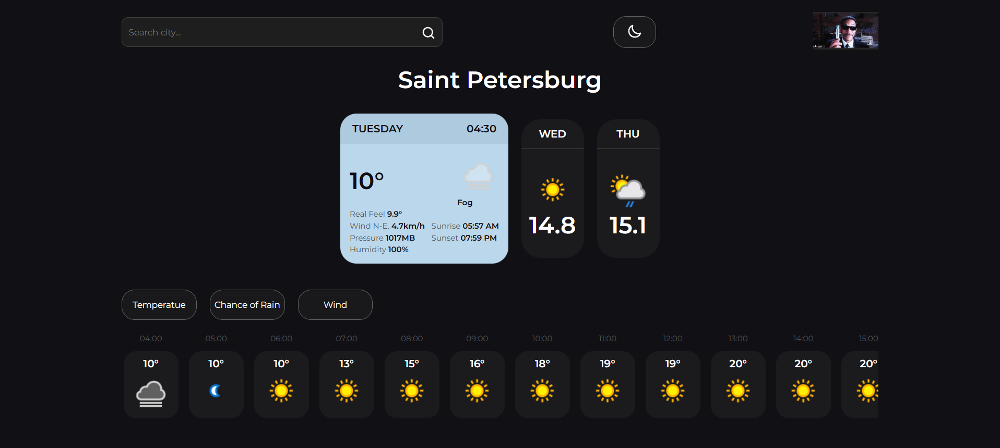
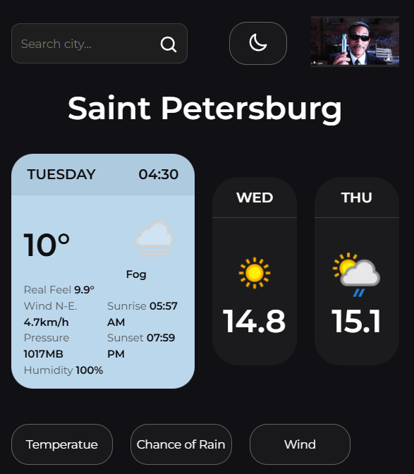

#Weather App

Training how to work with :
- layout,
- state,
- theme change,
- implenting typescript.

The app displays current and the next 2 days' forecast. It also:
- shows hourly forecast for the chosen day;
- saves the last query, in localstorage;
- provides suggestions while typing with debounce;
- basic light\dark theme
- mobile\desktop version exists.

## How to start

1. npm install
2. npm start

## Live Demo
[See the demo](https://google.com);
